# CoffeeConnect

## Hakkında

`CoffeeConnect`, kullanıcıların kolayca kahve siparişi verebildikleri, istediklerinde diğer kullanıcılarla paylaşımda bulunabildikleri ve kendi istek listelerini oluşturabildikleri bir iOS uygulamasıdır. Uygulama, MVC (Model-View-Controller) tasarım deseni kullanılarak geliştirilmiştir. Tamamen programatik olarak hazırlanmıştır; yani storyboard kullanılmadan geliştirilmiştir. Kullanıcı bilgileri ve sipariş detayları Firebase üzerinden yönetilmektedir.

## Özellikler

- **Programatik Arayüz**: Uygulama, storyboard kullanmadan tamamen programatik bir şekilde hazırlandı.
- **Firebase Entegrasyonu**: FirebaseAuth, FirebaseFirestore ve FirebaseStorage ile veritabanı ve depolama işlemleri gerçekleştirilmektedir.
- **Kahve Siparişi**: Kullanıcılar, uygulama üzerinden kahve siparişi verebilirler.
- **Sosyal Paylaşım**: Kullanıcılar, kendi postlarını oluşturup diğer kullanıcılarla paylaşabilirler.
- **Istek Listesi**: Kullanıcılar, favori kahvelerini veya denemek istedikleri kahveleri bir istek listesinde saklayabilirler.
- **Kullanıcı Girişi**: Kullanıcılar, uygulamaya kendi hesap bilgileri ile giriş yapabilirler.
- **MVC Tasarım Deseni**: Uygulama, MVC tasarım deseni kullanılarak organize edilmiştir.
- **Çoklu Dil Desteği**: Uygulama hem Türkçe hem de İngilizce dil seçeneklerini desteklemektedir.

## Kullandığım Paketler

- **SnapKit**: Programatik arayüz oluşturma için kullanılmıştır.
- **FirebaseAuth**: Kullanıcı giriş işlemleri için kullanılmıştır.
- **FirebaseFirestore**: Veritabanı işlemleri için kullanılmıştır.
- **FirebaseStorage**: Dosya ve resim depolama işlemleri için kullanılmıştır.
- **IQKeyboardManager**: Klavye davranışlarını yönetmek ve klavye ile ilgili kullanıcı deneyimini iyileştirmek için kullanılmıştır.

# Uygulama Görüntüleri

| Onboard 1 | Onboard 2 | Onboard 3 |
|-------------------|-------------------|-------------------|
| 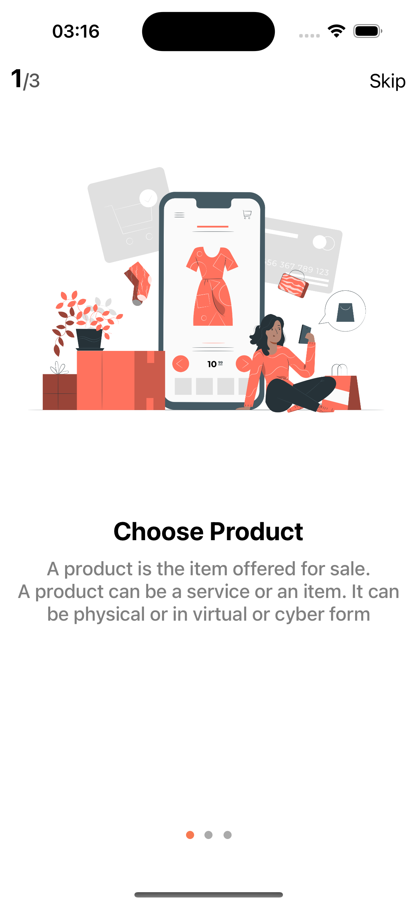 | 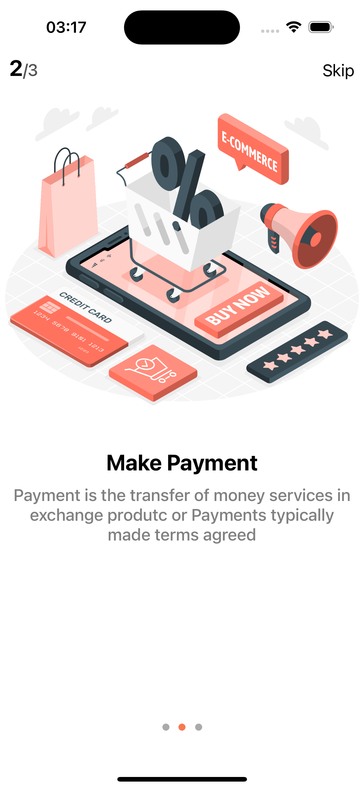 | 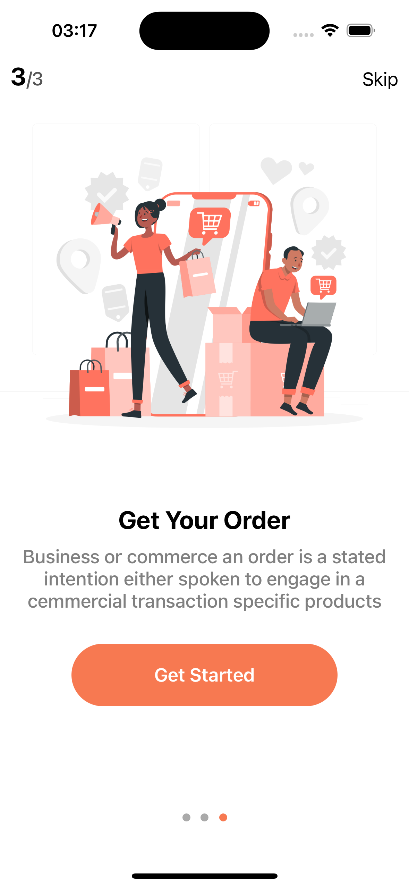 |

| Login | SignUp | Home |
|-------------------|-------------------|-------------------|
| 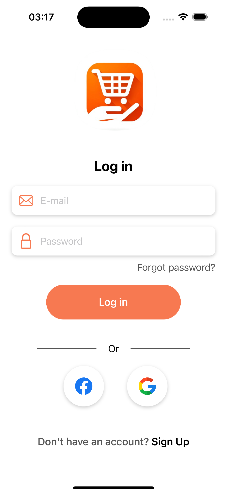 | 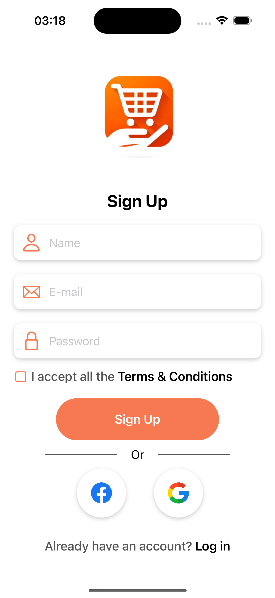 |  |

| Filter | Search | Favorite |
|-------------------|-------------------|-------------------|
| 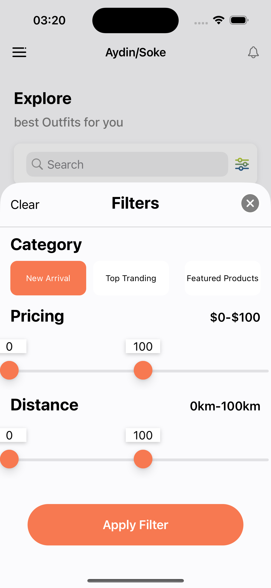 | 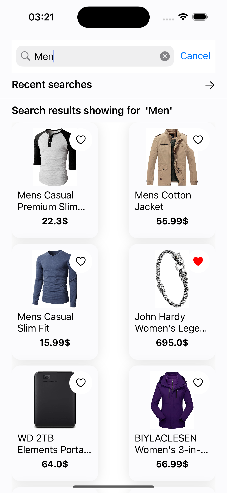 | 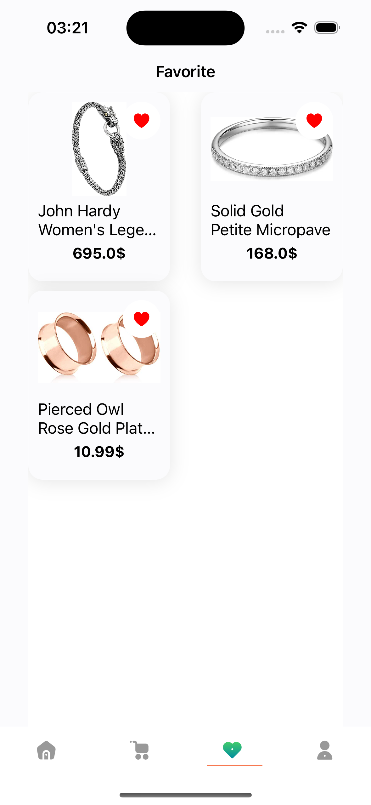 |

| Basket | Checkout | Success |
|-------------------|-------------------|-------------------|
| 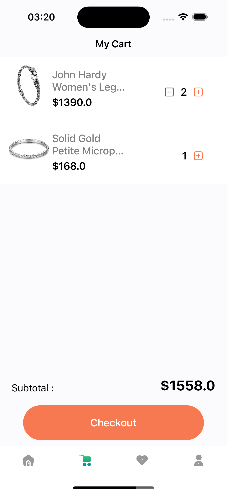 | 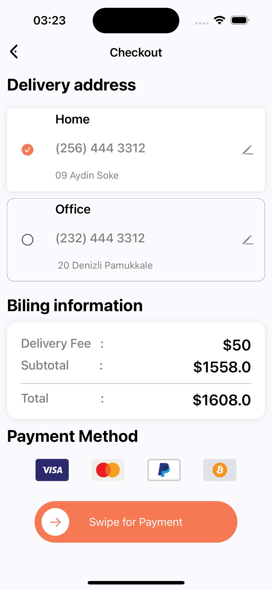 | 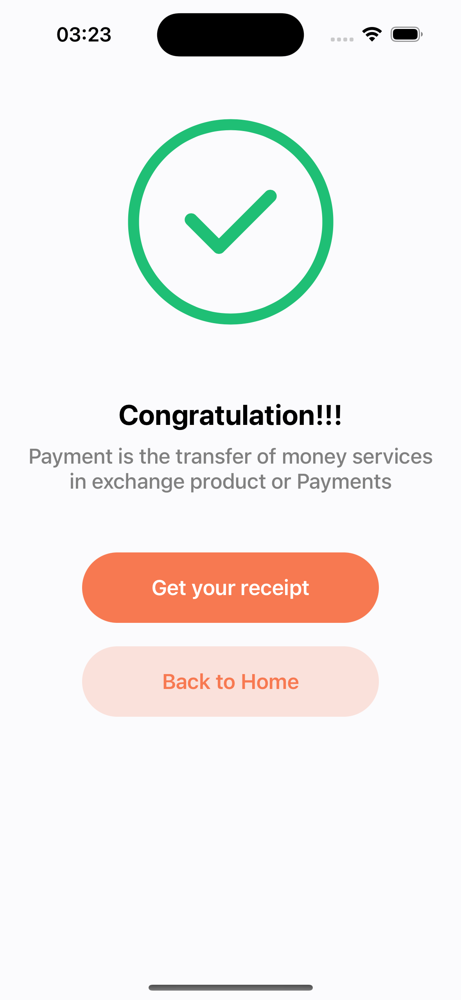 |

| Menu | Wallets | Profile |
|-------------------|-------------------|-------------------|
| 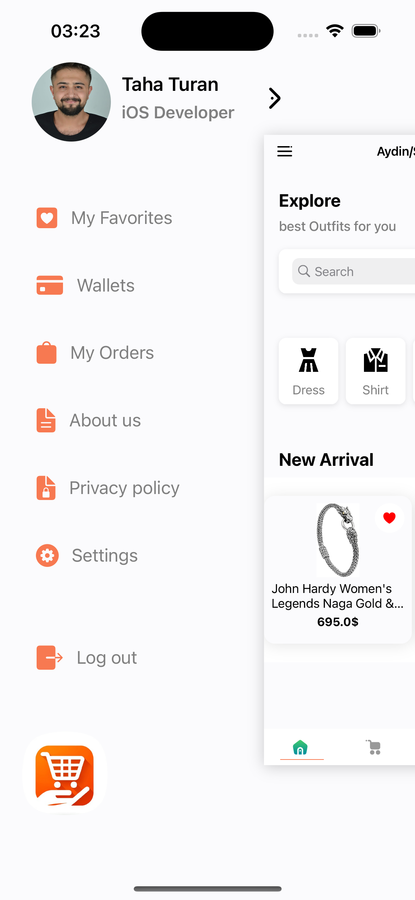 | 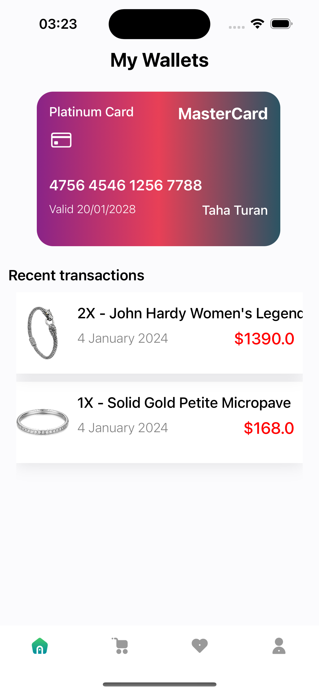 | 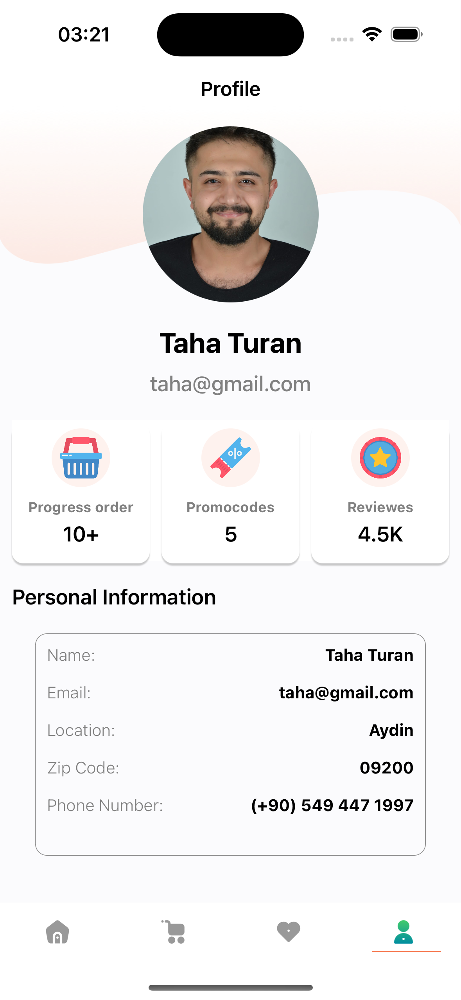 |

| Detail | Settings |
|-------------------|-------------------|
| 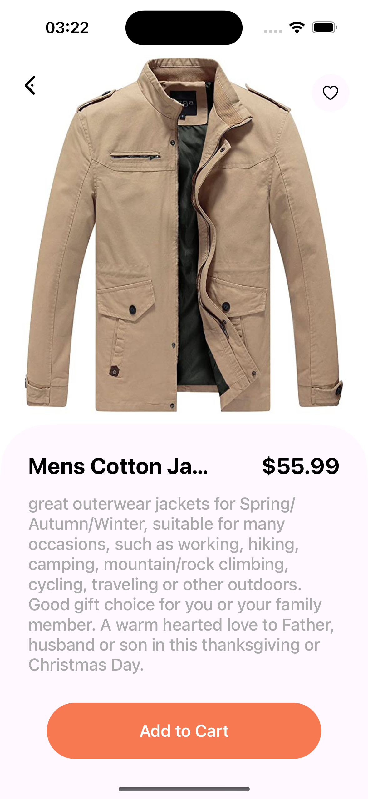 | 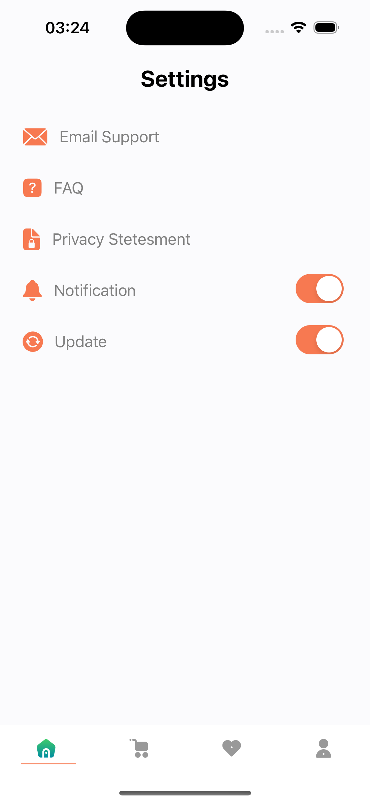 |

